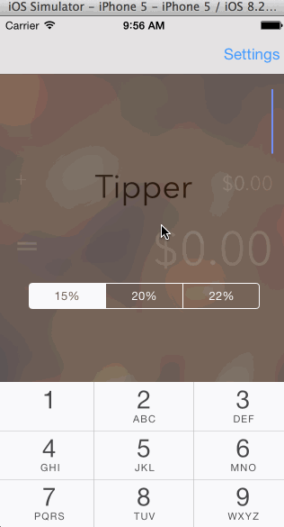

# tipper
Tip calculator - CodePath pre-assignment

This is a Tip Calculator application for iOS submitted as the pre-assignment requirement for CodePath.

Note: This was tested on the iPhone 5 in the Portrait orientation. Other screen sizes and the Landscape orientation are not supported.

Time spent: 5 hours total

Completed:

* [x] Required: User can enter a bill amount, choose a tip percentage, and see the tip and total values.
* [x] Required: Settings page to change the default tip percentage.
* [x] Optional: UI animations
* [x] Optional: Remembering the bill amount across app restarts (if <10mins)
* [ ] Optional: Using locale-specific currency and currency thousands separators.
* [x] Optional: Making sure the keyboard is always visible and the bill amount is always the first responder. This way the user doesn't have to tap anywhere to use this app. Just launch the app and start typing.

GIF created with [LiceCap](http://www.cockos.com/licecap/).